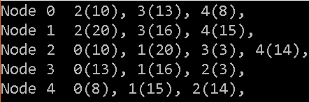

# Dijkstra Path finding bei einem Graph

 * [1.0 Benötigte Klassen](#1.0-Benötigte-Klassen)
   * [1.0.1 Class Graph](#1.0.1-Class-Graph)
     * [Variablen](#Variablen)
       * [Private](#Private)
     * [Public Methoden](#Public-Methoden)

## 1.0 Benötigte Klassen

### 1.0.1 Class Graph

####Variablen

##### Private

````cpp
vector<vector<int>> neighbours;
vector<vector<int>> weights;
````

#### Public Methoden

````cpp
unsigned int getNumberOfNodes();
Graph();
void randomInit(int nNodes=10, int nConnections=15, bool directed=false);
vector<int> getNeighbours(int node);
vector<int> getWeights(int node);

friend std::ostream& operator<<(std::ostream& s, const Graph & obj);
````


####Beschreibung

### 1.0.2 Class GraphUtil

#### Public Methoden

```cpp
static vector<Entry> dijkstra(Graph *g, int start);
static vector<int> getPath(Graph *g, int start, int end);
```

#### Private Methoden

````cpp
static int getNextNode(vector<Entry> &data);
static void getPath(vector<int> *path, vector<Entry> *entryVector, int start, int end);
````

####Beschreibung

### 1.0.3 Struct Entry

#### Variablen

```cpp
unsigned int nodeId;
int distance;
bool marked;
int predecessor;
```

####Beschreibung


## 2.0 Vorgehen (.cpp)

### 2.1 graph.cpp

####2.1.1 RandomInit

> Hier wird der Graph mit den in main.cpp angegebenen anzahl Knoten und Verbindungen gefüllt. Die Gewichtung wird noch zufällig gewählt dazu später mehr.

 **in Progress**


####2.1.2 getNumberOfNodes

````cpp
unsigned int Graph::getNumberOfNodes() {
	return neighbours.size();
}
````

bei *getNumberOfNodes()* erhält man die gesammtanzahl der Knoten *als Integer* die es im Graph gibt.

#### 2.1.3 getNeighbours(int node)

````cpp
vector<int> Graph::getNeighbours(int node) {
	return neighbours.at(static_cast<unsigned>(node));
}
````

bei *getNeighbours(int node)* erhält man alle Nachbarn des übergebenen *int node* Knoten als *Vector<int>*.

#### 2.1.4 ostream& operator<<(. . .)

````cpp
std::ostream& operator<<(std::ostream& s, const Graph & obj) {
	for (unsigned int i(0); i < obj.neighbours.size(); i++) {
		vector<int>::iterator it;
		s << "Node " << i << "\t";
		for (unsigned int j(0); j < obj.neighbours[i].size(); j++) {
			s << obj.neighbours[i].at(j) << "(" << obj.weights[i].at(j) << "), ";
		}
		s << endl;
	}
	return s;
}
````

Hierbei handelt es sich un eine überladung des **<< Operator**, mit anderen Worten kann man nun den Graphen mit all seinen Nachbarn via cout ausgeben lasen.

````cpp
cout << Graph << endl;
````

die Anzeige sieht dan wie folgt aus:


